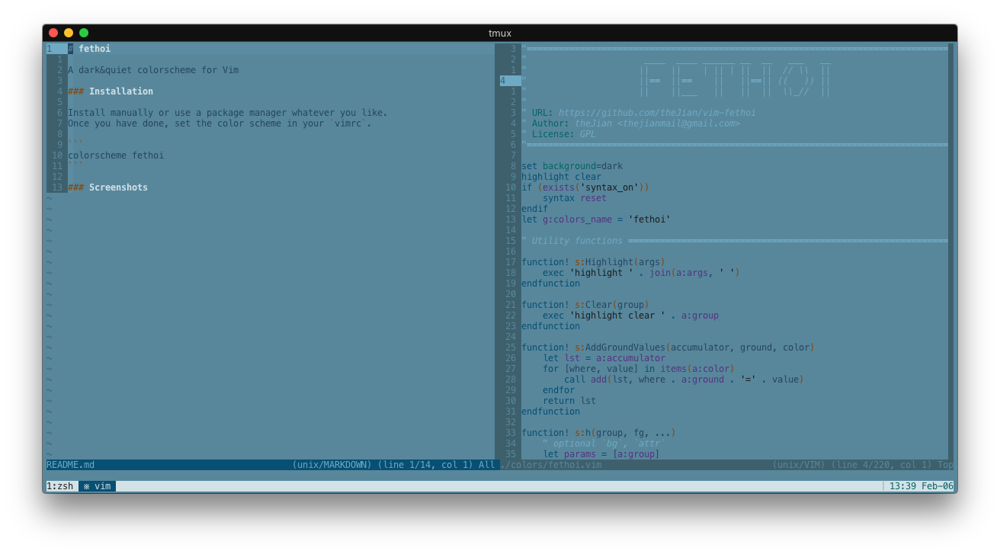
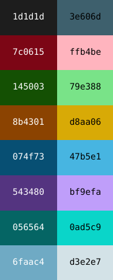

<div align="center">
	<h1>fethoi</h1>
	<p>A low contrast color scheme for vim</p>
</div>

### Installation

Install manually or use a package manager whatever you like.
Once you have done, set the color scheme in your `vimrc`.

```
colorscheme fethoi
```

### Gallery



### Palette



#### Other Environments

```
! special
*.foreground:   #254661
*.background:   #58879c
*.cursorColor:  #254661

! black
*.color0:       #1d1d1d
*.color8:       #3e606d

! red
*.color1:       #7c0615
*.color9:       #ffb4be

! green
*.color2:       #145003
*.color10:      #79e388

! yellow
*.color3:       #8b4301
*.color11:      #d8aa06

! blue
*.color4:       #074f73
*.color12:      #47b5e1

! magenta
*.color5:       #543480
*.color13:      #bf9efa

! cyan
*.color6:       #056564
*.color14:      #0ad5c9

! white
*.color7:       #6faac4
*.color15:      #d3e2e7

```

You can import this snippet as Xresources in [terminal.sexy](https://terminal.sexy/) then export as a different format or create your own variations.
